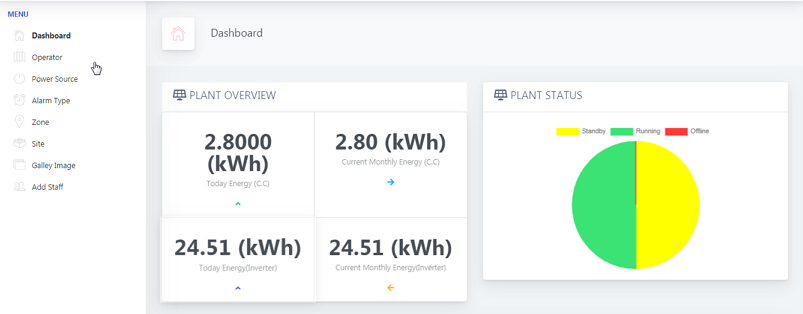
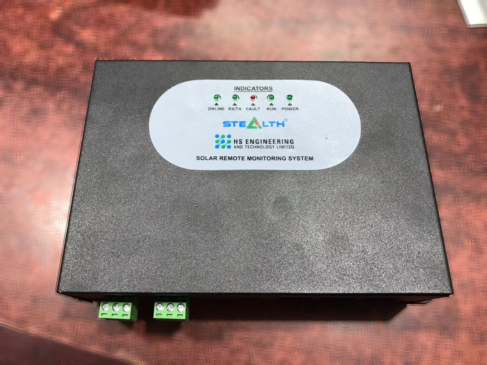

# Remote Monitoring System for Solar Sites
This project is a Remote Monitoring System (RMS) for large quantity solar operated sites. It is a custom firmware for specific tasks. This firmware target processor is STM32F107, build using CubeMX and Keil MicroVision. The device uses MODBUS to communicate with Grid Tie Inverter and Solar Charge Controller. It collects Energy generation data from the power modules and send the data to the cloud server.   
 
## Collected data processed and displayed in the Dashboard.  

 
## Device deployed to hundreds of sites to collect Energy Generation Data.  

 
## PCB with populated parts.  
